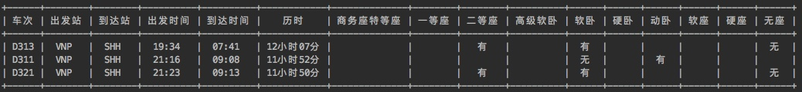

# search_tickets  
  
### **1. 工程简要说明**  
&nbsp;&nbsp;实现12306火车票查询功能  

### **2. 实现步骤和原理**
        2.1.安装依赖库
            requests——使用python访问http资源的必备库
            docopt——python3命令行参数解析工具（python也有类似的其他参数解析工具比如argparse，click）
            prettytable——格式化信息打印工具
            colorama——命令行着色工具
            注意：如果在多版本环境下使用pip可能会提示SSL错误，实际上是由于多版本的python使用的pip版本不一致的问题（删除重新装即可）
        2.2.请求
            2.2.1.URL
                https://kyfw.12306.cn/otn/leftTicket/query?leftTicketDTO.train_date={train_date}&leftTicketDTO.from_station={from_station}&leftTicketDTO.to_station={to_station}&purpose_codes=ADULT
            2.2.2.请求方法类型
                GET
            2.2.3.相关方法
                result=requests(url,verify=False)
                返回结果包含了一个response对象              
        2.3.数据准备
            车站输入为中文，但是查询参数问英文需要进行转换，parse_station.py获取车站中文和英文缩写对照表，写入stations.py中
        2.4.返回值
            一个response对象
            json格式的内容获取
                result.json()
                json内部数据项说明：
                    按照是否可预订，参数项有所区别，需要进行数据清洗：
                    （1）有票预订的参数项：
                        <有票状态编码>|"预订"字符串|编号|车次号|始发站|终点站|出发站|到达站|出发时间|到达时间|历时|<是否可预订标志位>|编码|出发日期|占位码|占位码|占位码|占位码|占位码|占位码||高级软卧||软卧|软座||无座||硬卧|硬座|二等座|一等座|商务座/特等座|动卧|占位码|占位码
                    （2）无票预订的参数项：
                        |"预订"字符串|编号|车次号|始发站|终点站|出发站|到达站|出发时间|到达时间|历时|<是否可预订标志位>|编码|出发日期|占位码|占位码|占位码|占位码|占位码|占位码||高级软卧||软卧|软座||无座||硬卧|硬座|二等座|一等座|商务座/特等座|动卧|占位码|占位码

### **3. 调用方法**    
        执行入口为工程项目下，执行命令：
            python search_tickets.py [-gdtkz] from_city to_city date
        参数说明：
            -h,--help   显示帮助菜单
            -g          高铁
            -d          动车
            -t          特快
            -k          快速
            -z          直达
 
### **4. 执行效果**
   执行结果以prettytable的方式打印在终端，效果如下：  
   